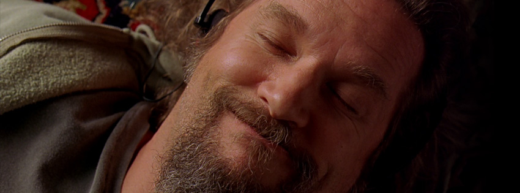

This is Akshay Mohan

Full time Full-stack developer & Part time Movie Buff.

Would love to contribute to open source world.

<!-- ## &#x1f4c8; GitHub Stats

 
 -->

 

## Latest Spotify Songs I am listening to

 

## XKCD of the Day

## 📣 Random Quote from characters of the Office TV Series (US version)

> Sometimes you have to take a break from being the kind of boss that’s always trying to teach people things. Sometimes you just have to be the boss of dancing.
>
> 
- Michael Scott

_Quote requested from [The Office API](https://officeapi.akashrajpurohit.com/quote/random)_

 

Last updated: 8/8/2025 23:26:37
